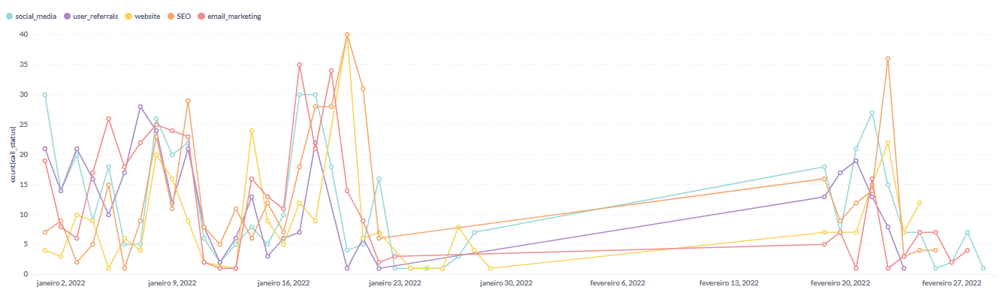

# Análise em SQL: gere planos de ação a partir das suas consultas
 Criando insights e gráficos por meio da linguagem SQL 

> Construa um dashboard utilizando SQL no metabase em busca de definir os próximos passos de uma Edtech. Deverá utilizar as informações para estabelecer a estratégia da empresa para o próximo ano.

## 1. Contexto

Suponha que você seja um analista de dados em uma empresa Edtech. Sua empresa está focada
em acelerar seu crescimento aumentando o número de usuários cadastrados.
Portanto, você foi solicitado a analisar vários aspectos da aquisição de clientes para ver o status
do crescimento de novos usuários em sua empresa.

## 2. Sobre os dados
Os dicionário dos dados foram definidos abaixo:

## 3. Entrega
Dessa forma, é necessário criar um dashboard para permitir que a equipe de
negócios desenvolva planos de ação com o objetivo de aumentar o número de usuários
cadastrados e impulsionar o crescimento da empresa.

## 4. Desenvolvimento e códigos SQL

- [x] Para saber a distribuição de pessoas do sexo masculino e feminino foi utilizado o código:

`select 
count(lead_id), gender
from 
leads_basic_details
group by 
gender`

**Gráfico de pizza:**

- [x] Consulta da quantidade de leads por grau de escolaridade:

`select count(lead_id) as Quantidade, current_education
from leads_basic_details
group by current_education
order by Quantidade`

**Gráfico de barras:**
 

- [x] Percentual de tempo assistido pela por idioma:

`language, avg(watched_percentage) as Porcentagem
from leads_demo_watched_details
where watched_percentage > 0.5
group by language`

**Obteve-se a tabela:**
 

 

- [x] Quantidade de ligações atendidas por plataforma ao longo do tempo:

`select call_done_date, lead_gen_source, count(call_status)
from leads_interaction_details
left join 
leads_basic_details on leads_interaction_details.lead_id = leads_basic_details.lead_id
where 
call_status = 'successful'
group by 
lead_gen_source, call_done_date`

**Gráfico de linhas:**

 

## 5. Conclusão

Mesmo com as consultas simples em SQL no METABASE, foi possível obter insights sobre os usuários que utilizam a plataforma assim como, com os dados obtidos, construir estratégias para a aquisição de novos clientes no futuro. 
